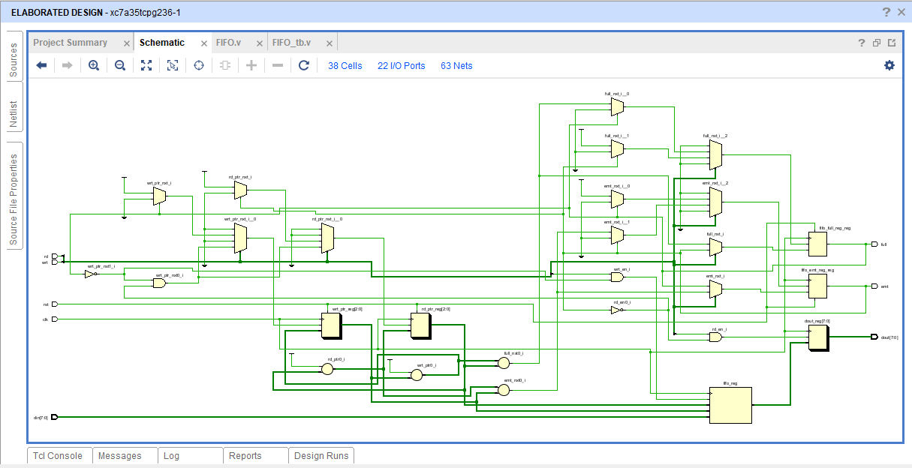
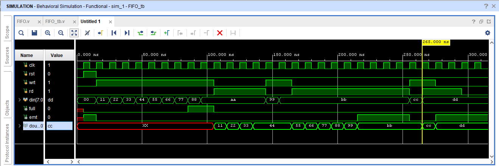

# Synchronous FIFO Design Using Verilog HDL

## Overview

This project presents the design and verification of an 8×8 Synchronous FIFO (First-In-First-Out) using Verilog HDL. The FIFO supports controlled data storage and retrieval using a single clock signal while maintaining the order of incoming data.

The design includes write and read pointer management, Full and Empty status flag generation, and protection against overflow and underflow conditions.

## Features

- 8×8 FIFO memory organization
- Single-clock synchronous operation
- Write and read pointer management
- Full and Empty flag generation
- Overflow and underflow protection
- Simultaneous read/write support
- RTL schematic generation and simulation using Vivado

## Tools Used

- Verilog HDL
- Xilinx Vivado

## Project Structure

```

Synchronous-FIFO-Verilog
│
├── FIFO.v
├── FIFO_tb.v
├── FIFO_schematic.png
├── FIFO_vivado_sim.png
├── Synchronous_FIFO_Report.pdf
└── README.md

```

## RTL Schematic



## Simulation Results




## Verification Scenarios

- FIFO Fill Operation
- FIFO Empty Operation
- Overflow Protection
- Underflow Protection
- Simultaneous Read and Write Operation

## Future Enhancements

- Parameterized FIFO design
- Increased FIFO depth
- Asynchronous FIFO implementation
- FPGA hardware implementation
- Almost Full and Almost Empty flags

## Author

**Priya Nageswari Karanam**

ECE Undergraduate | RTL Design & Verification Enthusiast

